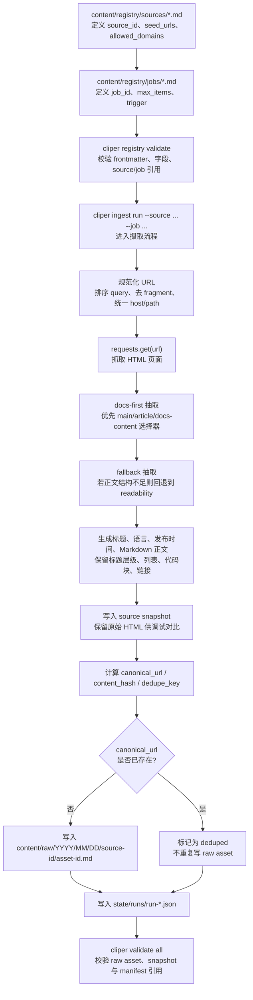

# Cliper

Cliper is the ingestion layer for Hermes. It owns source and job registries, web URL ingestion, raw Markdown assets, run manifests, and validation gates. It does not do knowledge linking or publishing.

## Milestone 1A scope

- Contract-first repository bootstrap
- Markdown registry for ingestion sources and jobs
- One executable `web_url` ingest path
- Raw asset writing with provenance and dedupe
- Run manifests plus validation gates
- Topic dossier contract only; no dossier builder yet

## Layout

```text
.planning/              GSD bootstrap artifacts
contracts/schemas/      Canonical frontmatter contracts
content/registry/       Markdown source and job registry
content/raw/            Written raw assets
docs/                   Architecture, validation, migration docs
src/cliper/             Python package and CLI
state/                  Derived indexes and run manifests
tests/                  Contract and integration tests
```

## Ingestion flow

Cliper is a controlled seed-URL ingestor, not a full-site crawler. It reads URLs from the Markdown registry, fetches HTML, extracts main-content Markdown, dedupes on canonical URL, and writes raw Markdown assets plus run manifests.



## CLI

Run from the repo root:

```bash
uv run cliper registry validate
uv run cliper ingest run --source example-web-source
uv run cliper validate all
```

If you prefer a traditional environment, install the package editable first and then run `cliper ...`.

## Optional Skill: Source Intake

The repo now also exposes the `source-intake` optional skill as packaged commands:

```bash
uv run source-intake "https://example.com/post" --raw-dir ./llm-wiki/docs/raw --review-dir ~/.hermes/intake/review --archive-dir ~/.hermes/intake/archive
uv run source-intake-cron --raw-dir ./llm-wiki/docs/raw --review-dir ~/.hermes/intake/review --archive-dir ~/.hermes/intake/archive
uv run cliper source-intake run "https://example.com/post" --raw-dir ./llm-wiki/docs/raw --review-dir ~/.hermes/intake/review --archive-dir ~/.hermes/intake/archive
```

Skill-specific docs live here:

- `optional-skills/research/source-intake/README.md`
- `optional-skills/research/source-intake/README.zh-CN.md`

## Validation gates

- Registry and raw assets must have valid frontmatter
- Raw assets must include provenance, `canonical_url`, `content_hash`, and `dedupe_key`
- New ingests also persist `refs.source_snapshot` so extractor output can be compared against the original HTML
- Jobs must reference an existing source and adapter
- Repeated ingestion of the same canonical URL must dedupe
- Every ingest run must emit a run manifest
- Topic dossier schema exists only as a downstream contract in 1A
